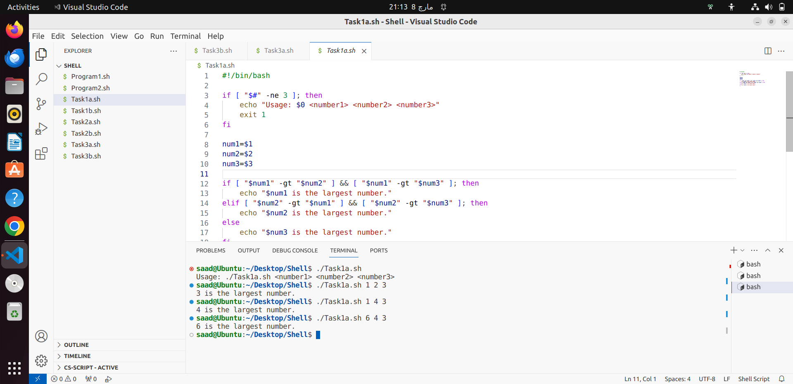
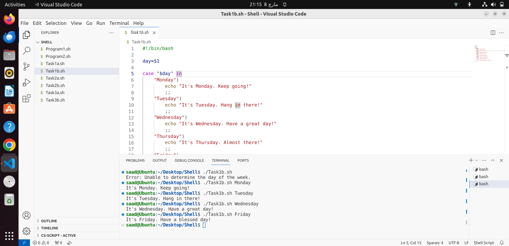
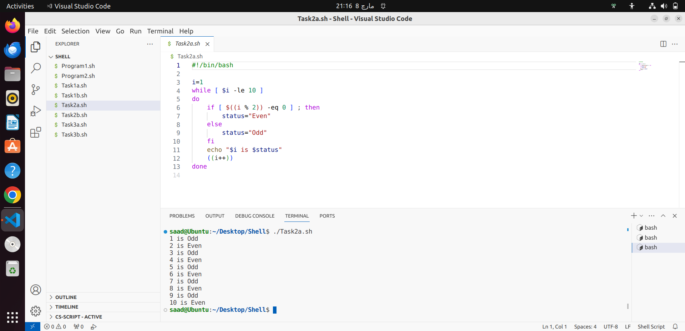
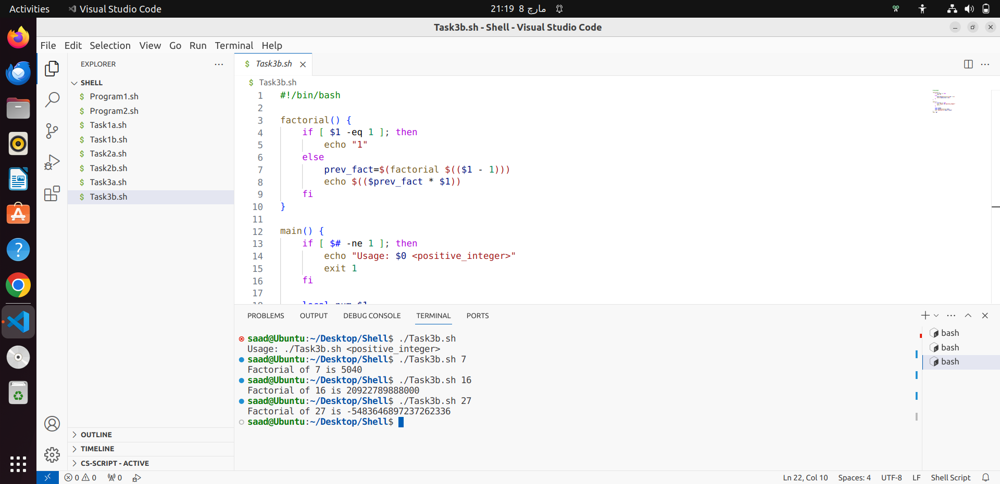

# Operating Systems Lab 4

## Submitted by
Saad Ahmad Malik  

2022-CS-1  

## Supervised by
Mr. Numan Shafi

---

## Introduction
This lab submission includes solutions to various shell script tasks along with their corresponding output images.

---

## Tasks

### Task 1.1: 
*Task Description:* Create a Bash script which will take 3 numbers as command line arguments. It will print to the screen the larger of the three numbers.

*Solution:*
```bash
#!/bin/bash

if [ "$#" -ne 3 ]; then
    echo "Usage: $0 <number1> <number2> <number3>"
    exit 1
fi

num1=$1
num2=$2
num3=$3

if [ "$num1" -gt "$num2" ] && [ "$num1" -gt "$num3" ]; then
    echo "$num1 is the largest number."
elif [ "$num2" -gt "$num1" ] && [ "$num2" -gt "$num3" ]; then
    echo "$num2 is the largest number."
else
    echo "$num3 is the largest number."
fi
```

*Output Image:*



---

### Task 1.2: 

*Task Description:* Create a Bash script which will print a message based upon which day of the week it is (eg. 'Happy day' for Wednesday, 'blessed' for Friday etc) using switch statement.

*Solution:*

```bash
#!/bin/bash

day=$1

case "$day" in
    "Monday")
        echo "It's Monday. Keep going!"
        ;;
    "Tuesday")
        echo "It's Tuesday. Hang in there!"
        ;;
    "Wednesday")
        echo "It's Wednesday. Have a great day!"
        ;;
    "Thursday")
        echo "It's Thursday. Almost there!"
        ;;
    "Friday")
        echo "It's Friday. Have a blessed day!"
        ;;
    "Saturday")
        echo "It's Saturday. Enjoy your weekend!"
        ;;
    "Sunday")
        echo "It's Sunday. Relax and recharge!"
        ;;
    *)
        echo "Error: Unable to determine the day of the week."
        ;;
esac
```

*Output Image:*



---

### Task 2.1: 

*Task Description:* Create a simple script which will print the numbers 1 - 10 (each on a separate line) and whether they are even or odd.

*Solution:*

```bash
#!/bin/bash

i=1
while [ $i -le 10 ]
do
    if [ $((i % 2)) -eq 0 ] ; then
        status="Even"
    else
        status="Odd"
    fi
    echo "$i is $status"
    ((i++))
done
```

*Output Image:*



---

### Task 2.2: 

*Task Description:* Write a program that read number as input, calculate, and return the summation of the all digits of the number. Example: If given number: 745 Then result will be: (7+4+5) = 16

*Solution:*

```bash
#!/bin/bash

number=$1
temp=$1
sum=0

while [ $number -gt 0 ];
do
    digit=$((number % 10))     
    sum=$((sum + digit))
    number=$((number / 10))    
done

echo "Sum of digits of $temp = $sum"
```

*Output Image:*


---

### Task 3.1: 

*Task Description:* Write a shell script which takes a positive integer as an argument on the terminal and then checks if it is a palindrome or not. In order to find the reverse of this number it must be passed to function named reverse(), which computes the reverse and passes both, the number and its reverse to another function called palindromeCheck(). palindromeCheck() then compares the numbers and echoes if the number is a palindrome or not.

*Solution:*

```bash
#!/bin/bash

reverse() {
    local num=$1
    local rev=0
    while [ $num -gt 0 ]; do
        rev=$((rev * 10 + num % 10))
        num=$((num / 10))
    done
    echo "$rev"
}

palindromeCheck() {
    local num=$1
    local rev=$2
    if [ $num -eq $rev ]; then
        echo "The number $num is a palindrome."
    else
        echo "The number $num is not a palindrome."
    fi
}

main() {
    # Check if argument is provided
    if [ $# -ne 1 ]; then
        echo "Usage: $0 <positive_integer>"
        exit 1
    fi

    local num=$1
    local rev=$(reverse $num)
    palindromeCheck $num $rev
}

# Call the main function with command-line argument
main "$@"
```

*Output Image:*


---

### Task 3.2: 

*Task Description:* Write a shell script which reads a number from the user and passes it to function named factorial(). This function finds the factorial of the number and prints it on the terminal. This task must be done using recursion.

*Solution:*

```bash
#!/bin/bash

factorial() {
    if [ $1 -eq 1 ]; then 
        echo "1"
    else 
        prev_fact=$(factorial $(($1 - 1)))
        echo $(($prev_fact * $1))
    fi
}

main() {
    if [ $# -ne 1 ]; then
        echo "Usage: $0 <positive_integer>"
        exit 1
    fi

    local num=$1
    local fact=$(factorial $num)
    echo "Factorial of $num is $fact"
}
main "$@"
```

*Output Image:*



---


### Github Repository Link: https://github.com/fsfrahmad/OS-Lab.git

